# Project Shots
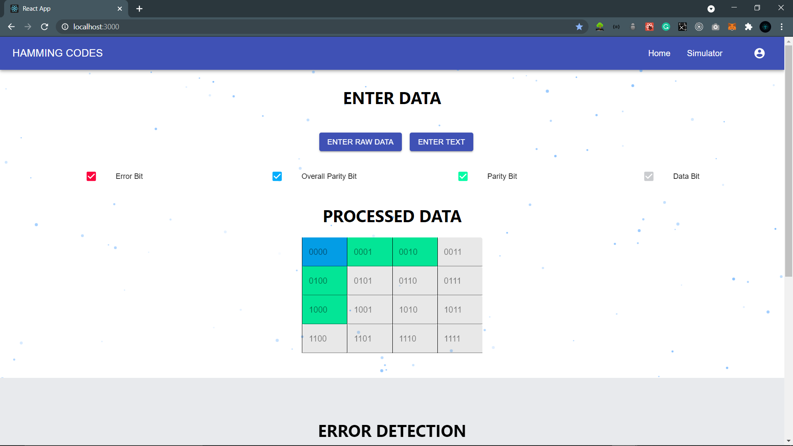
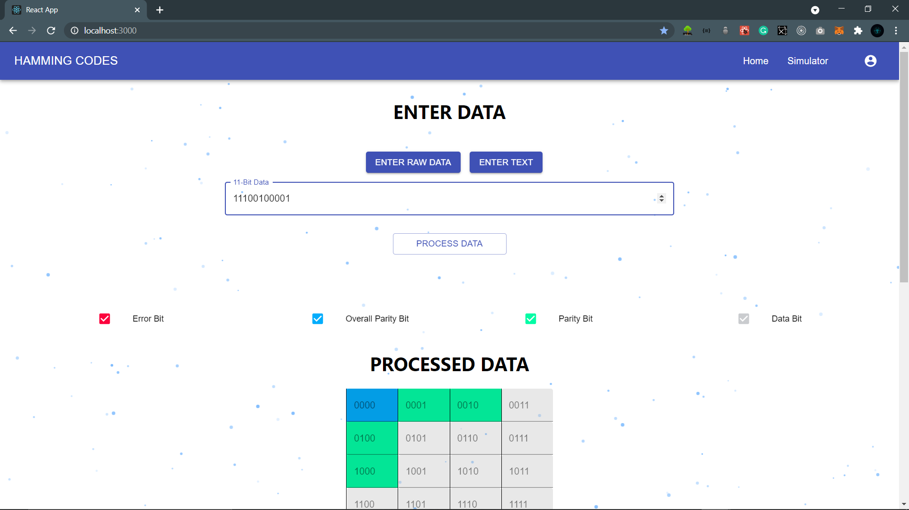
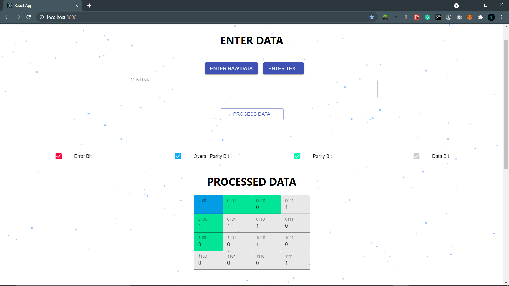
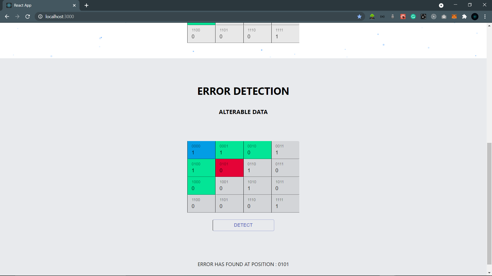

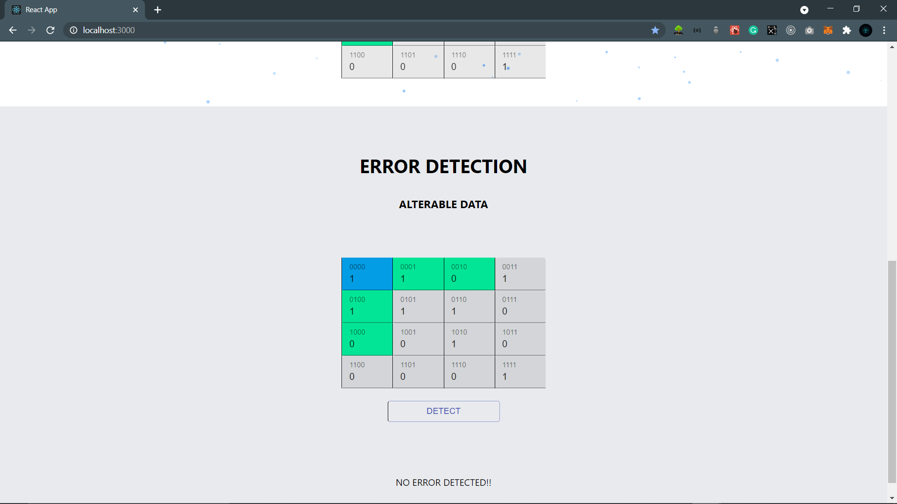
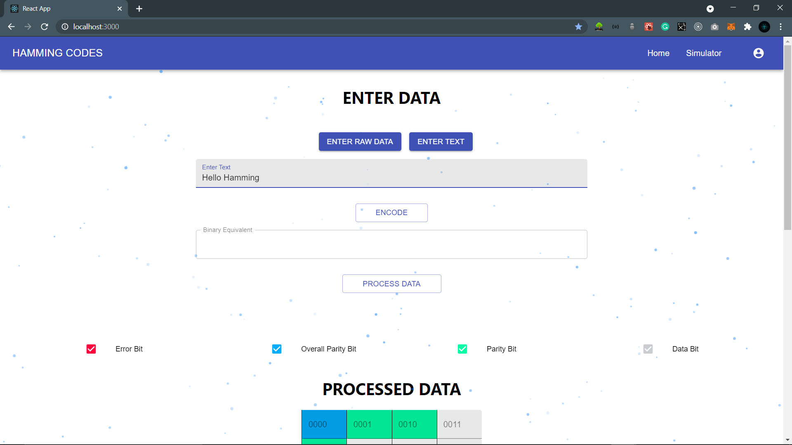
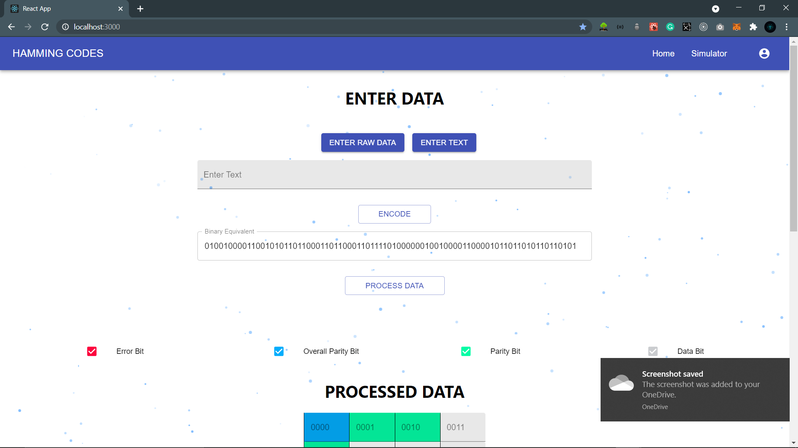
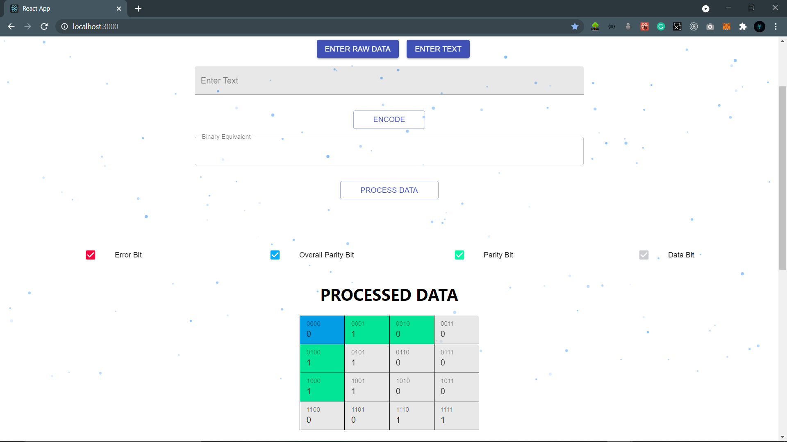
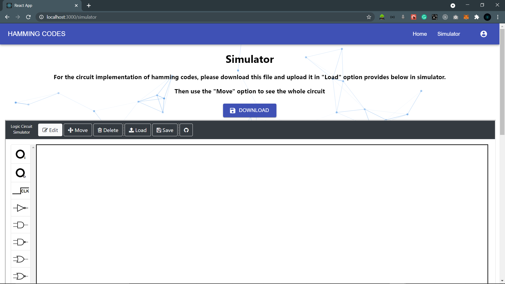
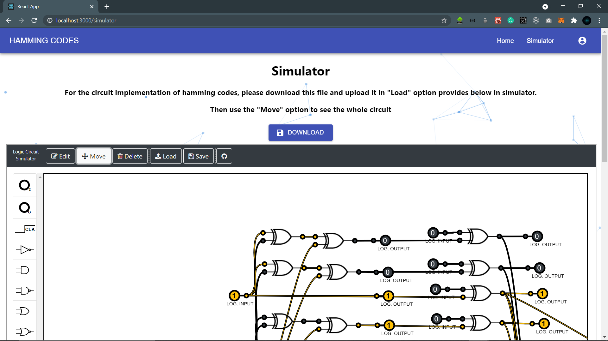
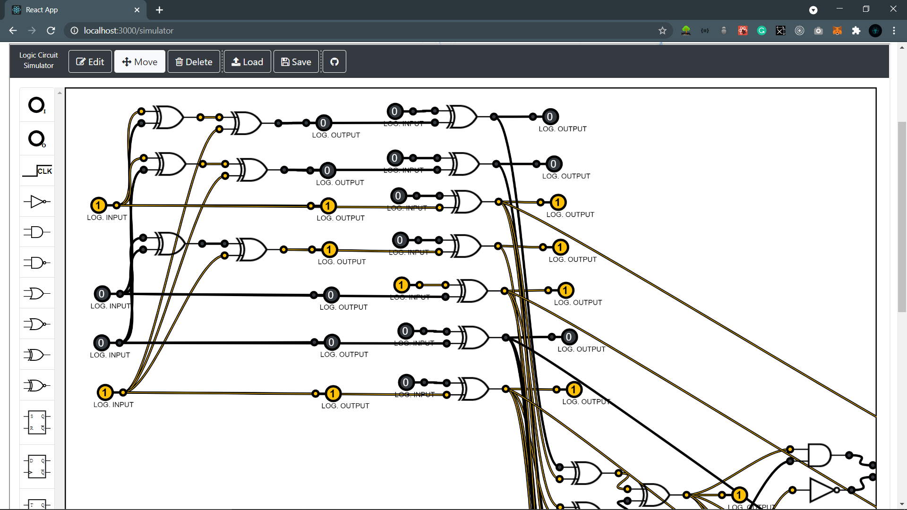

# Open For The Contibution

## Available Scripts

In the project directory, you can run:

### `npm start`

Runs the app in the development mode.\
Open [http://localhost:3000](http://localhost:3000) to view it in the browser.

### /simulator

To visit circuit simulator page

The page will reload if you make edits.\
You will also see any lint errors in the console.

